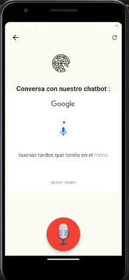
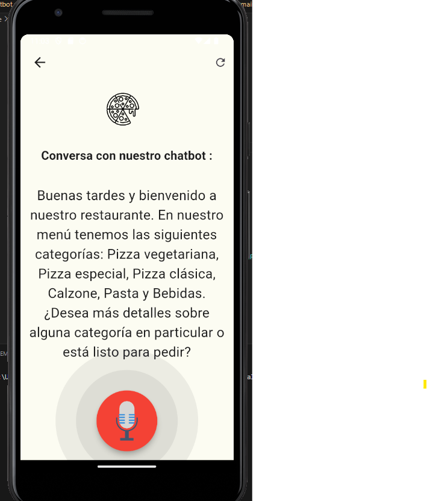
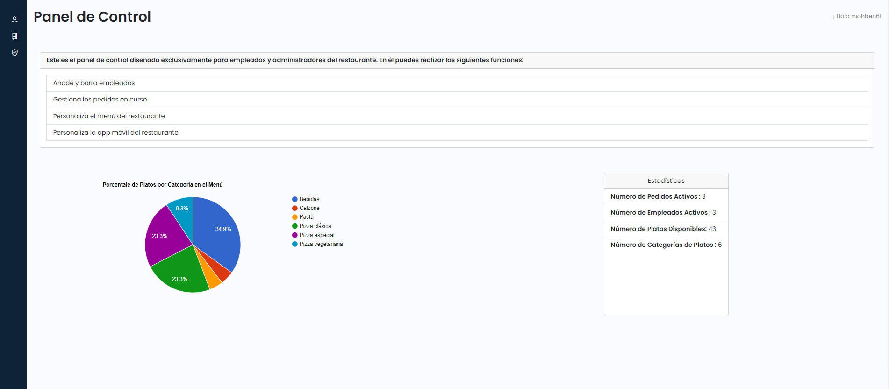
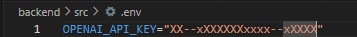
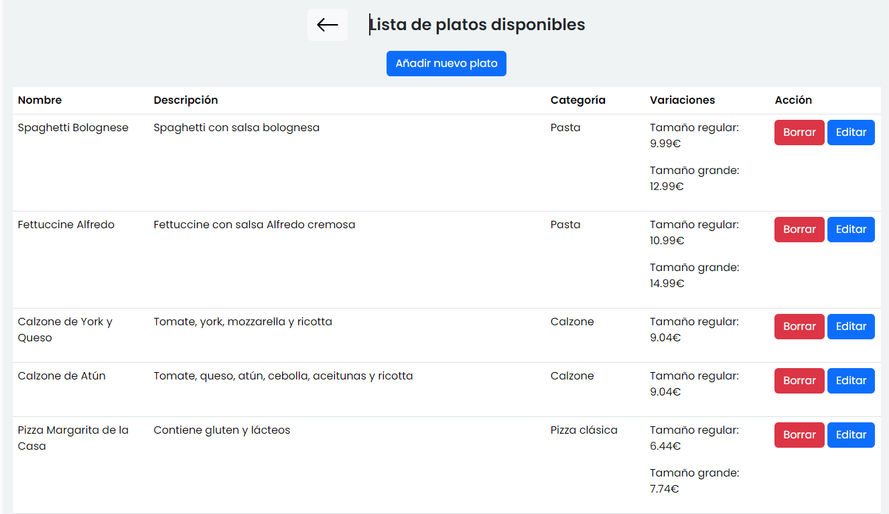
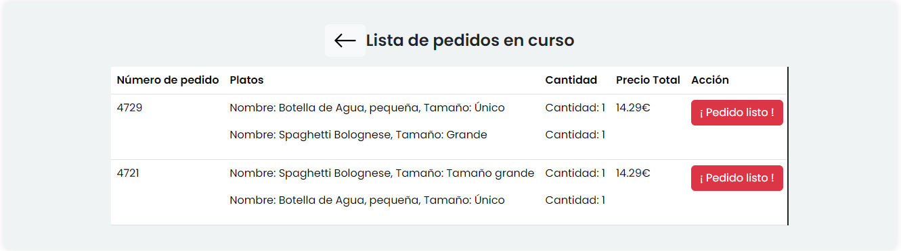

[](https://github.com/AmineBennani7/Proyecto-Reconocimiento-Vocal)


[](https://github.com/AmineBennani7/Proyecto-Reconocimiento-Vocal/blob/master/README.es.md)


# Voice-Based Restaurant Order Virtual Assistant for Mobile App:

## About This Project

This project consists of a mobile application that integrates a voice recognition system to allow users to interact with a personalized virtual assistant in the hospitality sector. Users can request information about available dishes and place orders directly through the application using voice commands.

The virtual assistant operates in an intelligent and optimized manner, recording orders placed by users and generating a complete list of selected dishes along with the total price at the end of the interaction. The assistant never leaves the context of the restaurant setting. If a requested dish is not present in the restaurant's database, the assistant responds negatively, informing the user that the dish is not available.

For the correct operation of the chatbot, it connects through **Langchain to the OpenAI API**, specifically using the **GPT-4-1106-preview** model to provide intelligent and contextually appropriate responses during interactions.

In addition, the system includes a web application intended exclusively for restaurant employees or administrators. This application will allow them to manage orders received and make adjustments related to the configuration of the mobile application and the personalization of the restaurant menu.

<div style="display: flex; justify-content: space-between; align-items: center; margin-bottom: 20px;">
    
    
</div>



## Built with

This project has been developed using the following main technologies and tools:
- 
- 
- 
- 
- 
- 
- 


## Getting Started 

1. **Clone the repository :**

  ```bash
git clone https://github.com/AmineBennani7/Proyecto-Reconocimiento-Vocal
  ```

2. **Install Dependencies:**

Run the following command in your terminal:

```bash
pip install -r requirements.txt
 ```

3. **Generation of a personal key in OPENAI:**

To use the GPT-4-1106-preview model of OpenAI in your application, you will need to generate a personal key in the OpenAI platform. For this, you should follow the following steps:

3.1. Go to the official **[OpenAI](https://platform.openai.com/settings/profile?tab=api-keys)** page and create an account if you don't have one yet.

3.2. Go to the API setting section and find the option to **generate a new API key**. Remember to keep your API key safe and not to share it with anyone.

3.3. Create a new virtual environment **.env** and enter the secret key generated in OpenAI:

```bash
cd backend/src/chatbot/ && python -m venv .env
```


&nbsp;


4. **Run the following files the first time:**

4.1. Load the default menu items into the database, which the administrator can later modify through the web application.

```bash
python "backend/src/database/load_data.py"
```

4.2. Transform the menu items in the database into a CSV format that can be correctly read by the chatbot.

```bash
python "backend/src/chatbot/get_menu_dataset.py"
```

## Program use
Next, it explains what needs to be run each time you want to use the program:

Run the backend for the correct operation of the chatbot:
```bash
python "backend/src/api/api_main.py"
```

Run the backend for the correct operation of the web server:
```bash
python "web/server/app.py"
```

Go to the following directory and run **main.dart** to make the mobile application function. Previously, the mobile emulator should have been set up.
 
```bash
cd .\mobile\mobile\mobile_order\lib
```
Run the web application for employees and administrator.

```bash
cd .\web\frontend ; npm start
```


## More images 


&nbsp;




## Contact

Amine Bennani - [](https://www.linkedin.com/in/amine-bennani-51638410a/)

Project link - [](https://github.com/AmineBennani7/Smart-Voice-Restaurant-Assistant)


